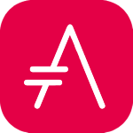

= Ressources Utiles - Index
Auteur: Corentin Chiodo
Date:: {docdate}
:doctype: book
:icons: font
:toc: left
:toc-title: Table des matières
:toclevels: 3
:source-highlighter: highlight.js
// :title-page-background-image: image:cover.png[fit=none,pdfwidth=70%, position= top center]
// :title-logo-image: image:logo.png[top=90%,align=left, scale=25%]

include::example.html[]

include::header.adoc[]

[cols="4,6", grid=none, frame=none]
|===

a|
[cols="1,1", grid=none, frame=none]
!===
!
link:++./Pages/Ressources - AsciiDocs.html++[AsciiDocs]

image:./Images/LaTex.png[logo, 32, 32]
link:++./Pages/Ressources - Latex.html++[LaTex]

link:++./Pages/Ressources - Regex.html++[Regex]

link:++./Pages/Ressources - Python.html++[Python]

!
link:++./Pages/Ressources - Web.html++[Web]

link:++./Pages/Ressources - Git.html++[Git]

!===

|

|===
